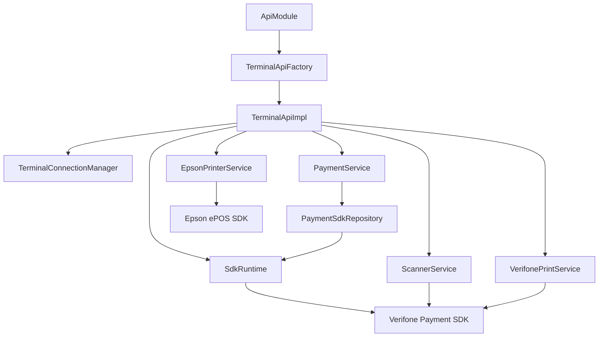

# Arkitektur

**Målgrupp:** utvecklare av integrationslagret.

Den här sidan beskriver modulens interna struktur. Publik användning finns i
[Introduktion](introduction.md) och [TerminalApi](api/terminal-api.md).

## Ansvarsgräns

Applikationslagret ska se `ApiModule` och `TerminalApi`. Allt under
`com.example.testv660p.internal` är implementation och får ändras utan att
app-lagret behöver känna till PSDK.

## Objektgraf

## Centrala komponenter

- `ApiModule`: processägare och publik startpunkt.
- `TerminalApiFactory`: bygger objektgrafen för fysisk terminal.
- `TerminalApiImpl`: implementerar `TerminalApi` genom delegation.
- `SdkRuntime`: wrapper runt Verifone Payment SDK.
- `TerminalConnectionManager`: anslutningsstatus och återanslutning.
- `PaymentService`: betalningsfasad och publik felmappning.
- `PaymentSdkRepository`: SDK-nära transaktionsadapter.

Detaljer per klass finns i [Intern översikt](internal/overview.md).

## Livscykel

Start, anslutning och teardown beskrivs i:

- [Initiering](lifecycle/initialization.md)
- [Anslutning och återanslutning](lifecycle/connection.md)
- [Nedstängning](lifecycle/teardown.md)
