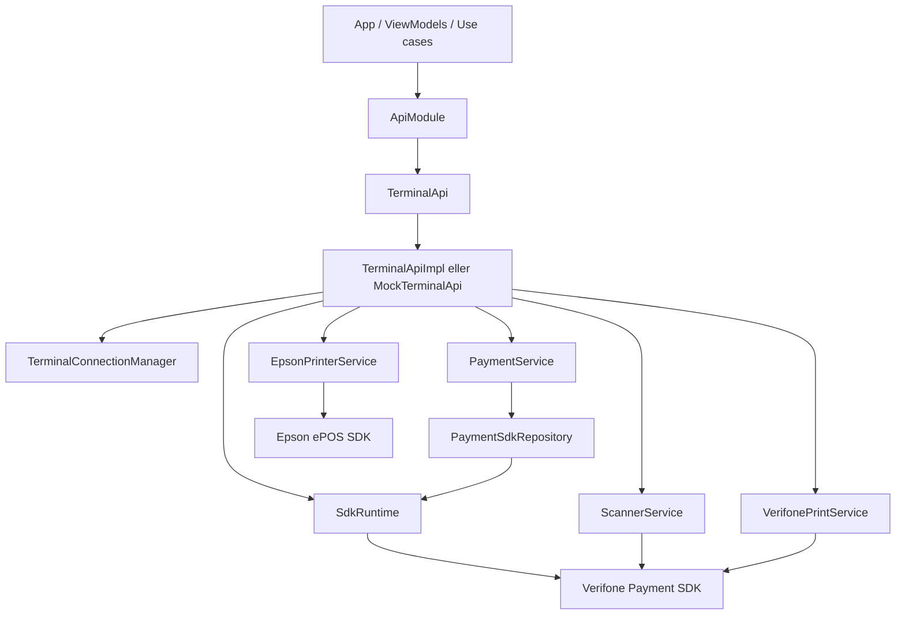

# Arkitektur

Integrationslagret är byggt som ett tunt publikt API ovanpå interna tjänster som
kapslar PSDK:s runtime, sessioner, transaktioner, skrivare och scanner.

## Publik yta

`TerminalApi` är kontraktet som applikationslagret använder. Det exponerar:

- statusflöden: `terminalReady`, `terminalConnected`, `deviceInfo`
- eventflöden: `logs`, `scannedCode`
- terminalflöden: betalning, refund, void, split payment och abort
- enhetsflöden: scanner och utskrift

`ApiModule` ansvarar för att välja implementation:

- `MockTerminalApi` när `setUseEmulatedTerminal(true)` används.
- `TerminalApiImpl` när fysisk terminal används.

## Interna ansvar

`SdkRuntime` kapslar `PaymentSdk`, registrerar listenern och översätter SDK-events
till Kotlin-flöden. Den hanterar initiering, login, logout, teardown och
device-information.

`TerminalConnectionManager` beräknar `terminalReady`, håller anslutningsstatus och
försöker återinitiera terminalen vid tappad anslutning eller initieringsproblem.

`PaymentSdkRepository` är den lägsta betalningsnära adaptern mot PSDK:s
`TransactionManager`. Den startar och avslutar sessioner, skickar betalnings-,
refund- och void-kommandon och väntar på relevanta SDK-events.

`PaymentService` är den applikationsnära betalningstjänsten. Den skyddar mot
parallella betalningar, mapper interna fel till `PaymentError` och använder
`PaymentSessionCoordinator` för sessionens livscykel.

`ScannerService` konfigurerar PSDK-scannern och skickar scannerresultat vidare
till `TerminalApi.scannedCode`.

`VerifonePrintService` skriver via terminalens skrivare. `EpsonPrinterService`
skriver via en separat Epson-anslutning, främst för off-device-scenarier.

## Ägarskap

Applikationslagret får inte skapa eller hålla egna instanser av de interna
klasserna. Det ska inte heller starta PSDK direkt. Det är viktigt eftersom
PSDK-runtimen, terminalanslutningen och aktiv session måste ha en gemensam ägare.

Den ägaren är `ApiModule` och den `CoroutineScope` som skickas till
`ApiModule.start(scope)`.
