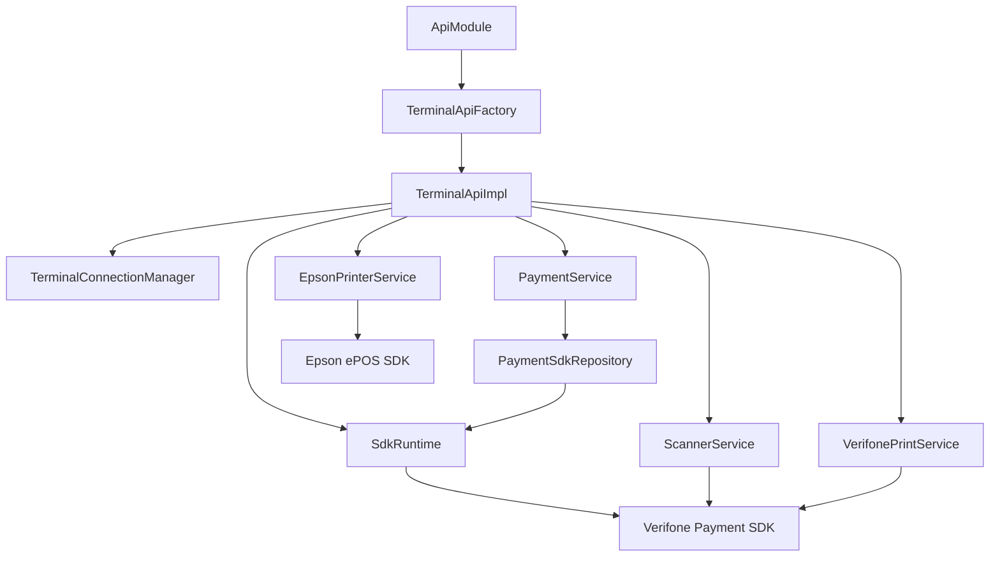

# Architecture

**Target audience:** developers of the integration layer.

This page outlines the module’s internal architecture. For external usage, see [Introduction](introduction.md).

## Responsibility boundary

The application layer interacts only with `ApiModule` and `TerminalApi`. All code within `com.example.testv660p.internal` is considered internal implementation within the integration layer.

## Object graph

Details per class are available in [Internal overview](integration-development/internal-overview.md).

## Lifecycle

Startup, connection, and teardown are described in:

* [Initialization](lifecycle/initialization.md)
* [Connection and reconnection](lifecycle/connection.md)
* [Teardown](lifecycle/teardown.md)